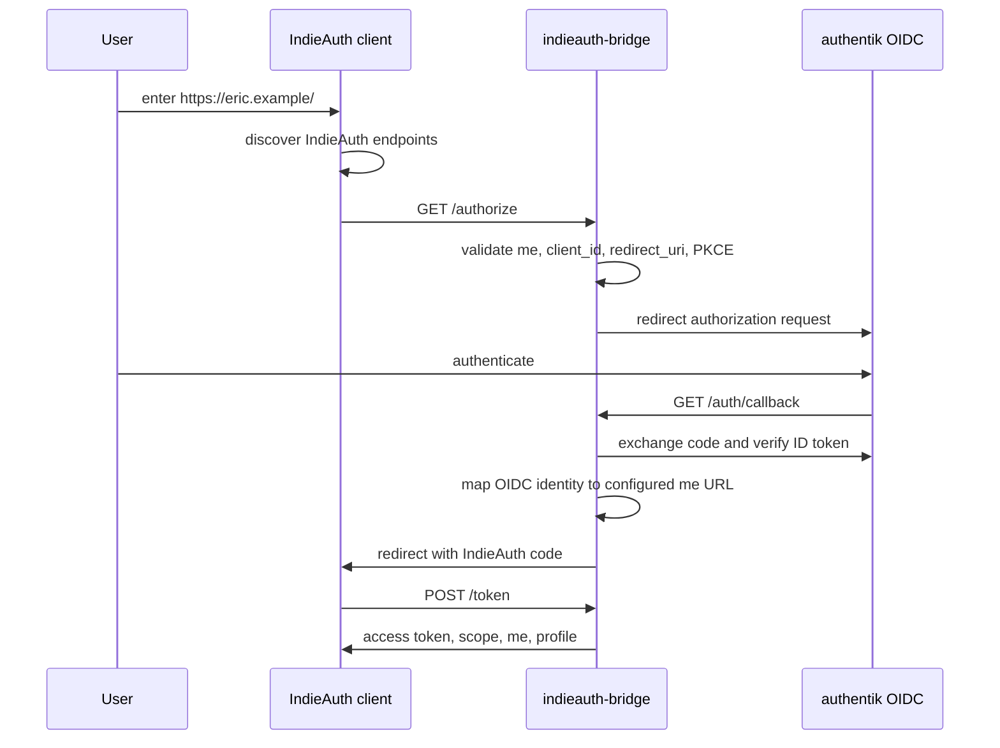

# IndieAuth Bridge

Experimental self-hostable IndieAuth-to-OIDC bridge for people who want to sign in to IndieAuth-compatible clients with their profile URL while delegating authentication to an OIDC provider.

The first supported backend is [authentik](https://goauthentik.io/) over standard OIDC. The backend boundary is generic so additional OIDC providers or other authentication systems can be added without rewriting the IndieAuth server flow.

## Architecture



## Security Model

The bridge is an authorization server for a small, explicitly configured set of profile URLs. It does not manage users. A login succeeds only when the OIDC identity returned by authentik matches at least one configured selector for the requested `me` URL: subject, username, email, or group.

Secure defaults:

- HTTPS is required unless `security.dev_mode` is enabled.
- PKCE S256 is required for IndieAuth authorization requests by default.
- Authorization codes are short-lived, hashed at rest, and one-use.
- Access tokens are stored hashed at rest.
- OIDC state and nonce are generated with `crypto/rand` and validated.
- Redirect URIs must share origin with `client_id` for the MVP.
- Security headers and no-store token responses are set.
- Callback URLs and tokens are not logged.

Limitations:

- Dynamic client registration is not implemented.
- IndieAuth client metadata discovery is not yet implemented; redirect URI validation is same-origin with `client_id`.
- SQLite is the only storage backend.
- There is no consent screen in the MVP.

## Quick Start

Create a config:

```sh
cp examples/config.yaml config.yaml
chmod 600 config.yaml
```

Edit the public bridge URL, authentik settings, and profile mapping. Use a strong random `security.cookie_secret`.

Run locally with Podman:

```sh
podman build -t indieauth-bridge:local -f Containerfile .
podman run --rm \
  -p 8080:8080 \
  -v ./config.yaml:/config/config.yaml:ro \
  -v indieauth-bridge-data:/data \
  -e IAB_CONFIG=/config/config.yaml \
  indieauth-bridge:local
```

For local HTTP testing only, set `security.dev_mode: true`, `security.require_https: false`, and use HTTP URLs consistently.

## Configuration

Minimal shape:

```yaml
server:
  listen: ":8080"
  public_url: "https://indieauth.example.org"
  issuer: "https://indieauth.example.org"

security:
  cookie_secret: "replace-with-at-least-32-random-bytes"
  code_ttl: "5m"
  auth_request_ttl: "10m"
  access_token_ttl: "24h"
  require_https: true
  require_pkce: true
  dev_mode: false

profiles:
  - me: "https://eric.example/"
    display_name: "Eric"
    email: "eric@example.org"
    backend: "authentik"
    allowed_subjects: ["authentik-user-sub"]
    allowed_usernames: ["eric"]
    allowed_emails: ["eric@example.org"]

backends:
  authentik:
    type: "authentik"
    issuer: "https://auth.example.org/application/o/indieauth/"
    client_id: "..."
    client_secret: "..."
    redirect_uri: "https://indieauth.example.org/auth/callback"
    scopes: ["openid", "profile", "email"]

storage:
  type: "sqlite"
  path: "/data/bridge.db"
```

Environment overrides use the `IAB_` prefix:

- `IAB_CONFIG`
- `IAB_SERVER_LISTEN`
- `IAB_SERVER_PUBLIC_URL`
- `IAB_SERVER_ISSUER`
- `IAB_SECURITY_COOKIE_SECRET`
- `IAB_SECURITY_DEV_MODE`
- `IAB_SECURITY_REQUIRE_HTTPS`
- `IAB_SECURITY_REQUIRE_PKCE`
- `IAB_STORAGE_PATH`
- `IAB_BACKENDS_AUTHENTIK_ISSUER`
- `IAB_BACKENDS_AUTHENTIK_CLIENT_ID`
- `IAB_BACKENDS_AUTHENTIK_CLIENT_SECRET`
- `IAB_BACKENDS_AUTHENTIK_REDIRECT_URI`

## Authentik Setup

In authentik:

1. Create or choose an Application.
2. Add an OAuth2/OpenID Provider.
3. Set client type to `Confidential`.
4. Set redirect URI to `https://indieauth.example.org/auth/callback`.
5. Enable scopes `openid`, `profile`, and `email`.
6. Copy the issuer URL, client ID, and client secret into the bridge config.
7. Configure the bridge profile mapping so the authentik user can claim the desired IndieAuth profile URL.

Recommended selectors:

- Use `allowed_subjects` for the strongest stable mapping.
- Add `allowed_usernames` or `allowed_emails` only when you understand how those claims are managed in your authentik tenant.
- Use `allowed_groups` when membership is the administrative control point.

The authentik issuer usually looks like:

```text
https://auth.example.org/application/o/indieauth/
```

## Profile Website Setup

Add IndieAuth discovery links to the HTML for your profile URL:

```html
<link rel="indieauth-metadata" href="https://indieauth.example.org/.well-known/oauth-authorization-server">
<link rel="authorization_endpoint" href="https://indieauth.example.org/authorize">
<link rel="token_endpoint" href="https://indieauth.example.org/token">
```

Metadata example:

```json
{
  "issuer": "https://indieauth.example.org",
  "authorization_endpoint": "https://indieauth.example.org/authorize",
  "token_endpoint": "https://indieauth.example.org/token",
  "response_types_supported": ["code"],
  "grant_types_supported": ["authorization_code"],
  "code_challenge_methods_supported": ["S256"],
  "scopes_supported": ["profile", "email"],
  "token_endpoint_auth_methods_supported": ["none"]
}
```

## Reverse Proxy

Caddy:

```caddyfile
indieauth.example.org {
  reverse_proxy 127.0.0.1:8080
}
```

nginx:

```nginx
server {
  listen 443 ssl http2;
  server_name indieauth.example.org;

  location / {
    proxy_pass http://127.0.0.1:8080;
    proxy_set_header Host $host;
    proxy_set_header X-Forwarded-Proto https;
    proxy_set_header X-Forwarded-For $proxy_add_x_forwarded_for;
  }
}
```

## Podman Quadlet

Example unit: `docs/indieauth-bridge.container`

```ini
[Container]
Image=ghcr.io/OWNER/indieauth-bridge:latest
ContainerName=indieauth-bridge
PublishPort=127.0.0.1:8080:8080
Volume=/srv/indieauth-bridge/config.yaml:/config/config.yaml:ro
Volume=/srv/indieauth-bridge/data:/data
Environment=IAB_CONFIG=/config/config.yaml

[Service]
Restart=always

[Install]
WantedBy=default.target
```

## GitHub Actions and Images

The test workflow runs:

```sh
gofmt
go mod tidy
go vet ./...
go test ./...
go test -race ./...
```

The container workflow builds with Buildah and pushes to GHCR on `main` and `vX.Y.Z` tags. Published tags include:

- `latest` for `main`
- the git SHA
- `vX.Y.Z` and `X.Y.Z` for semver tags

OCI labels include source, revision, version, and description.

## Development

Run locally:

```sh
go run ./cmd/indieauth-bridge -config examples/config.yaml
```

Run checks:

```sh
gofmt -w .
go vet ./...
go test ./...
go test -race ./...
go mod tidy
```

Build a container:

```sh
podman build -t indieauth-bridge:local -f Containerfile .
```

## Adding a Backend

Implement `internal/backends.Backend`:

```go
type Backend interface {
    Name() string
    BeginAuth(ctx context.Context, req AuthRequest) (redirectURL string, state BackendState, err error)
    CompleteAuth(ctx context.Context, callback CallbackRequest, state BackendState) (Identity, err error)
}
```

Most OIDC providers should reuse `internal/backends/oidc`. Provider-specific packages should mainly set defaults, normalize claims when necessary, and document provider setup. Non-OIDC backends can return the same stable `Identity` fields and use the same configured profile authorization checks.

## Threat Model

Primary threats and mitigations:

- Open redirect: redirect URIs are absolute, fragment-free, HTTPS by default, and same-origin with `client_id`.
- Code interception: PKCE S256 is required by default, codes expire quickly, and codes are one-use.
- OIDC replay or mix-up: backend state and nonce are stored server-side and checked on callback; ID tokens are verified for issuer, audience, expiry, signature, and nonce by `go-oidc`.
- Token database disclosure: authorization codes and access tokens are stored as SHA-256 hashes.
- Profile claim confusion: a backend identity must match explicit configured selectors for the requested `me`.

Operational responsibilities:

- Put the bridge behind HTTPS.
- Protect `config.yaml` and SQLite data.
- Keep authentik client secrets private.
- Prefer `allowed_subjects` over mutable user claims.

## Troubleshooting

- `invalid redirect_uri`: ensure the IndieAuth client's `redirect_uri` has the same scheme, host, and port as `client_id`.
- `unknown me URL`: the submitted `me` URL must canonicalize to one of the configured `profiles[].me` values.
- `invalid or expired state`: the OIDC callback is stale, repeated, or did not originate from this bridge.
- `identity is not allowed`: the authentik user authenticated correctly but does not match the requested profile mapping.
- OIDC discovery failures: verify the authentik issuer URL and that the bridge can reach authentik from the container network.
