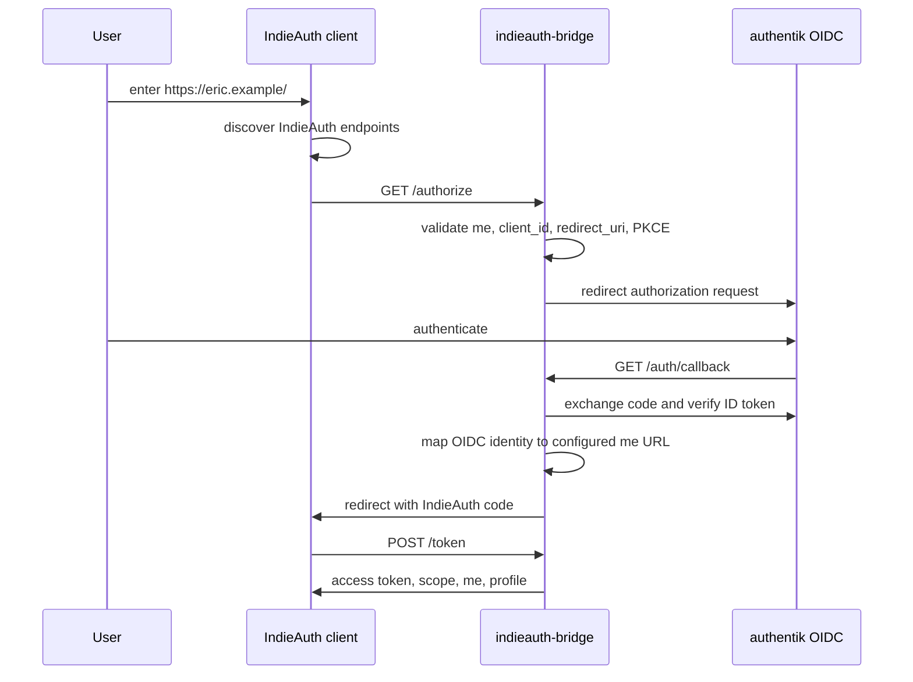

# IndieAuth Bridge

Experimental self-hostable IndieAuth-to-OIDC bridge for people who want to sign in to IndieAuth-compatible clients with their profile URL while delegating authentication to an OIDC provider.

The first supported backend is [authentik](https://goauthentik.io/) over standard OIDC. The backend boundary is generic so additional OIDC providers or other authentication systems can be added without rewriting the IndieAuth server flow.

## Architecture



## Security Model

The bridge is an authorization server for a small, explicitly configured set of profile URLs. It does not manage users. A login succeeds only when the OIDC identity returned by authentik matches at least one configured selector for the requested `me` URL: subject, username, email, or group.

Secure defaults:

- HTTPS is required unless `security.dev_mode` is enabled.
- PKCE S256 is required for IndieAuth authorization requests by default.
- Authorization codes are short-lived, hashed at rest, and one-use.
- Access tokens are stored hashed at rest.
- OIDC state and nonce are generated with `crypto/rand` and validated.
- Redirect URIs must either share origin with `client_id` or be declared by IndieAuth client metadata.
- A consent screen is shown before the bridge redirects back to the IndieAuth client by default.
- Public auth endpoints are protected by a small IP-based rate limiter.
- Security headers and no-store token responses are set.
- Callback URLs and tokens are not logged.

Limitations:

- Dynamic client registration is not implemented.
- SQLite is the only storage backend.
- Rate limiting is in-process. Use sticky routing or a proxy-level limiter if you run multiple bridge replicas.

## Quick Start

Create a config:

```sh
cp examples/config.yaml config.yaml
chmod 600 config.yaml
```

Edit the public bridge URL, authentik settings, and profile mapping. Use a strong random `security.cookie_secret`.

Run locally with Podman:

```sh
podman build -t indieauth-bridge:local -f Containerfile .
podman run --rm \
  -p 8080:8080 \
  -v ./config.yaml:/config/config.yaml:ro \
  -v indieauth-bridge-data:/data \
  -e IAB_CONFIG=/config/config.yaml \
  indieauth-bridge:local
```

For local HTTP testing only, set `security.dev_mode: true`, `security.require_https: false`, and use HTTP URLs consistently.

## Configuration

Minimal shape:

```yaml
server:
  listen: ":8080"
  public_url: "https://indieauth.example.org"
  issuer: "https://indieauth.example.org"

security:
  cookie_secret: "replace-with-at-least-32-random-bytes"
  code_ttl: "5m"
  auth_request_ttl: "10m"
  access_token_ttl: "24h"
  require_https: true
  require_pkce: true
  consent_required: true
  client_metadata_discovery_enabled: true
  dev_mode: false

rate_limit:
  enabled: true
  requests_per_minute: 60
  burst: 20
  trusted_proxies: []

profiles:
  - me: "https://eric.example/"
    display_name: "Eric"
    email: "eric@example.org"
    backend: "authentik"
    allowed_subjects: ["authentik-user-sub"]
    allowed_usernames: ["eric"]
    allowed_emails: ["eric@example.org"]

backends:
  authentik:
    type: "authentik"
    issuer: "https://auth.example.org/application/o/indieauth/"
    client_id: "..."
    client_secret: "..."
    redirect_uri: "https://indieauth.example.org/auth/callback"
    scopes: ["openid", "profile", "email"]

storage:
  type: "sqlite"
  path: "/data/bridge.db"
```

Environment overrides use the `IAB_` prefix:

- `IAB_CONFIG`
- `IAB_SERVER_LISTEN`
- `IAB_SERVER_PUBLIC_URL`
- `IAB_SERVER_ISSUER`
- `IAB_SECURITY_COOKIE_SECRET`
- `IAB_SECURITY_DEV_MODE`
- `IAB_SECURITY_REQUIRE_HTTPS`
- `IAB_SECURITY_REQUIRE_PKCE`
- `IAB_SECURITY_CONSENT_REQUIRED`
- `IAB_SECURITY_CLIENT_METADATA_DISCOVERY_ENABLED`
- `IAB_RATE_LIMIT_ENABLED`
- `IAB_RATE_LIMIT_REQUESTS_PER_MINUTE`
- `IAB_RATE_LIMIT_BURST`
- `IAB_STORAGE_PATH`
- `IAB_BACKENDS_AUTHENTIK_ISSUER`
- `IAB_BACKENDS_AUTHENTIK_CLIENT_ID`
- `IAB_BACKENDS_AUTHENTIK_CLIENT_SECRET`
- `IAB_BACKENDS_AUTHENTIK_REDIRECT_URI`

## Authentik Setup

In authentik:

1. Create or choose an Application.
2. Add an OAuth2/OpenID Provider.
3. Set client type to `Confidential`.
4. Set redirect URI to `https://indieauth.example.org/auth/callback`.
5. Enable scopes `openid`, `profile`, and `email`.
6. Copy the issuer URL, client ID, and client secret into the bridge config.
7. Configure the bridge profile mapping so the authentik user can claim the desired IndieAuth profile URL.

Recommended selectors:

- Use `allowed_subjects` for the strongest stable mapping.
- Add `allowed_usernames` or `allowed_emails` only when you understand how those claims are managed in your authentik tenant.
- Use `allowed_groups` when membership is the administrative control point.

To find the stable authentik subject claim, use authentik's provider test flow or any OIDC token inspection tool to inspect an ID token for the Application. The claim named `sub` is the value to put in `profiles[].allowed_subjects`. A typical workflow is:

1. Finish authentik provider setup with redirect URI `https://indieauth.example.org/auth/callback`.
2. Start a login from an IndieAuth client or OIDC test client.
3. Inspect the returned ID token claims.
4. Copy the exact `sub` value into `allowed_subjects`.
5. Keep username/email selectors as optional fallback selectors, not the primary authorization binding.

The authentik issuer usually looks like:

```text
https://auth.example.org/application/o/indieauth/
```

## Profile Website Setup

Add IndieAuth discovery links to the HTML for your profile URL:

```html
<link rel="indieauth-metadata" href="https://indieauth.example.org/.well-known/oauth-authorization-server">
<link rel="authorization_endpoint" href="https://indieauth.example.org/authorize">
<link rel="token_endpoint" href="https://indieauth.example.org/token">
```

IndieAuth clients whose callback URL is not the same origin as `client_id` should publish client metadata at their `client_id` URL. The bridge accepts either JSON:

```json
{
  "redirect_uris": ["https://client.example/callback"]
}
```

or an HTML link:

```html
<link rel="redirect_uri" href="https://client.example/callback">
```

Metadata example:

```json
{
  "issuer": "https://indieauth.example.org",
  "authorization_endpoint": "https://indieauth.example.org/authorize",
  "token_endpoint": "https://indieauth.example.org/token",
  "introspection_endpoint": "https://indieauth.example.org/introspect",
  "revocation_endpoint": "https://indieauth.example.org/revoke",
  "response_types_supported": ["code"],
  "grant_types_supported": ["authorization_code"],
  "code_challenge_methods_supported": ["S256"],
  "scopes_supported": ["profile", "email"],
  "token_endpoint_auth_methods_supported": ["none"]
}
```

## Reverse Proxy

Caddy:

```caddyfile
indieauth.example.org {
  header Strict-Transport-Security "max-age=31536000; includeSubDomains"
  request_body {
    max_size 64KB
  }
  reverse_proxy 127.0.0.1:8080
}
```

nginx:

```nginx
server {
  listen 443 ssl http2;
  server_name indieauth.example.org;
  client_max_body_size 64k;
  add_header Strict-Transport-Security "max-age=31536000; includeSubDomains" always;

  location / {
    proxy_pass http://127.0.0.1:8080;
    proxy_http_version 1.1;
    proxy_set_header Host $host;
    proxy_set_header X-Forwarded-Proto https;
    proxy_set_header X-Forwarded-For $proxy_add_x_forwarded_for;
    proxy_connect_timeout 5s;
    proxy_send_timeout 30s;
    proxy_read_timeout 30s;
  }
}
```

If the bridge is behind trusted reverse proxies and you want rate limiting to use the original client IP from `X-Forwarded-For`, configure `server.trusted_proxies` or `rate_limit.trusted_proxies` with the proxy IPs or CIDR ranges. Do not trust forwarded headers from arbitrary clients.

## Backup and Restore

SQLite state lives under the configured `storage.path`, normally `/data/bridge.db` in containers. Back up the database and its WAL sidecar files together:

```sh
podman stop indieauth-bridge
cp /srv/indieauth-bridge/data/bridge.db* /backup/indieauth-bridge/
podman start indieauth-bridge
```

For hot backups, use SQLite's online backup tooling from the host or a temporary maintenance container instead of copying only `bridge.db` while the service is running. Restore by stopping the service, replacing the database files from the backup, fixing ownership for the container user if needed, and starting the service again.

## Podman Quadlet

Example unit: `docs/indieauth-bridge.container`

```ini
[Container]
Image=ghcr.io/OWNER/indieauth-bridge:latest
ContainerName=indieauth-bridge
PublishPort=127.0.0.1:8080:8080
Volume=/srv/indieauth-bridge/config.yaml:/config/config.yaml:ro
Volume=/srv/indieauth-bridge/data:/data
Environment=IAB_CONFIG=/config/config.yaml

[Service]
Restart=always

[Install]
WantedBy=default.target
```

## GitHub Actions and Images

The test workflow runs:

```sh
test -z "$(gofmt -l $(git ls-files '*.go' ':!:vendor/*'))"
go mod tidy
go mod vendor
go vet -mod=vendor ./...
go test -mod=vendor ./...
go test -mod=vendor -race ./...
```

The container workflow builds with Buildah and pushes to GHCR on `main` and `vX.Y.Z` tags. Published tags include:

- `latest` for `main`
- the git SHA
- `vX.Y.Z` and `X.Y.Z` for semver tags

OCI labels include source, revision, version, and description.

The publishing workflow also generates an SPDX JSON SBOM and publishes GitHub artifact attestations for build provenance and the SBOM.

Dependabot is configured for Go modules with vendoring enabled, plus GitHub Actions updates. Go dependency PRs should include the corresponding `vendor/` changes.

## Development

Run locally:

```sh
go run ./cmd/indieauth-bridge -config examples/config.yaml
```

Validate configuration without starting the HTTP server:

```sh
go run ./cmd/indieauth-bridge check-config -config examples/config.yaml
```

Run checks:

```sh
gofmt -w $(git ls-files '*.go' ':!:vendor/*')
go mod tidy
go mod vendor
go vet -mod=vendor ./...
go test -mod=vendor ./...
go test -mod=vendor -race ./...
```

Dependencies are vendored in `vendor/`. After changing `go.mod`, run `go mod tidy` and `go mod vendor`, then commit the resulting `go.mod`, `go.sum`, and `vendor/` changes together.

Build a container:

```sh
podman build -t indieauth-bridge:local -f Containerfile .
```

## Adding a Backend

Implement `internal/backends.Backend`:

```go
type Backend interface {
    Name() string
    BeginAuth(ctx context.Context, req AuthRequest) (redirectURL string, state BackendState, err error)
    CompleteAuth(ctx context.Context, callback CallbackRequest, state BackendState) (Identity, err error)
}
```

Most OIDC providers should reuse `internal/backends/oidc`. Provider-specific packages should mainly set defaults, normalize claims when necessary, and document provider setup. Non-OIDC backends can return the same stable `Identity` fields and use the same configured profile authorization checks.

## Threat Model

Primary threats and mitigations:

- Open redirect: redirect URIs are absolute, fragment-free, HTTPS by default, and same-origin with `client_id`.
- Cross-origin client redirects: when enabled, client metadata discovery fetches `client_id` and accepts only declared `redirect_uris` or `rel=redirect_uri` links. In production mode it refuses metadata URLs that resolve to loopback, private, link-local, multicast, or unspecified IP addresses.
- Code interception: PKCE S256 is required by default, codes expire quickly, and codes are one-use.
- OIDC replay or mix-up: backend state and nonce are stored server-side and checked on callback; ID tokens are verified for issuer, audience, expiry, signature, and nonce by `go-oidc`.
- Token database disclosure: authorization codes and access tokens are stored as SHA-256 hashes.
- Profile claim confusion: a backend identity must match explicit configured selectors for the requested `me`.
- Unwanted approvals: consent is enabled by default so the user sees the client, redirect URI, profile, and requested scope before code issuance.

Operational responsibilities:

- Put the bridge behind HTTPS.
- Protect `config.yaml` and SQLite data.
- Back up `bridge.db` with its WAL sidecar files, or use SQLite online backup tooling.
- Keep authentik client secrets private.
- Prefer `allowed_subjects` over mutable user claims.

## Troubleshooting

- `invalid redirect_uri`: ensure the IndieAuth client's `redirect_uri` has the same origin as `client_id` or is declared in client metadata.
- `unknown me URL`: the submitted `me` URL must canonicalize to one of the configured `profiles[].me` values.
- `invalid or expired state`: the OIDC callback is stale, repeated, or did not originate from this bridge.
- `identity is not allowed`: the authentik user authenticated correctly but does not match the requested profile mapping.
- OIDC discovery failures: verify the authentik issuer URL and that the bridge can reach authentik from the container network.
- Consent page expired: restart the IndieAuth login flow; consent requests share the short authorization-code TTL.
- indieauth.com login compatibility: indieauth.com uses an older Web Sign-In flow without PKCE. Empty-scope sign-in requests are accepted for profile verification, while token exchange still requires PKCE when `security.require_pkce` is true.
- Client metadata fetch rejected: the `client_id` host may resolve to a private or local address; this is blocked outside dev mode to reduce SSRF risk.
